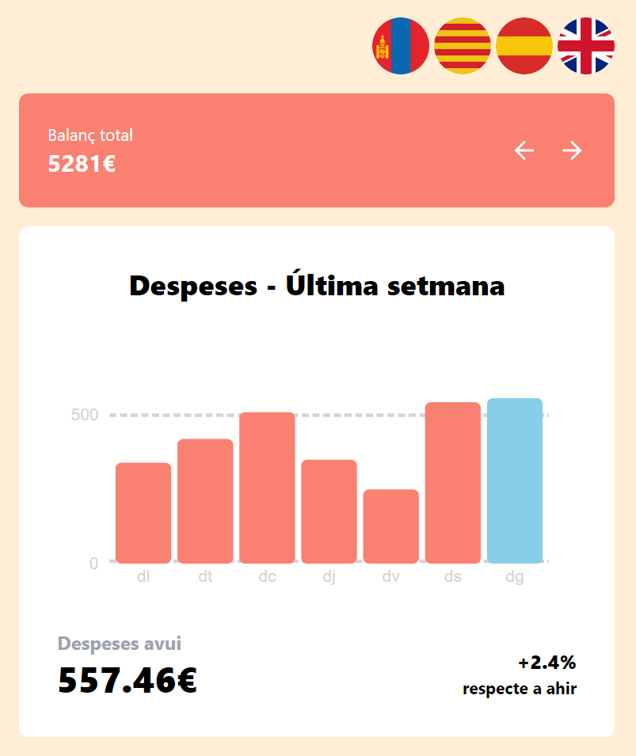
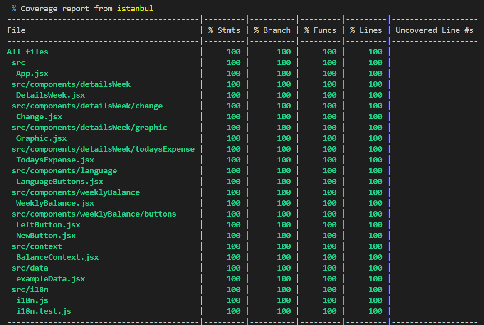

# Sprint 8 - Inprocode

This is the eighth sprint in the itacademy React.js course. The task was to follow the instructions and build a balance sheet implementing various frontend libraries.



To explore the source code, start with App.jsx .
**Note**: This project was initialized with Vite.

## How to run

After having cloned the repository, run the following commands at the root:

```sh
npm install
npm run dev
```

## Functionality overview

The example application is a data visualization page for daily expenses ovcer time.

**General functionality**:

- Showing expenses on last recorded day
- Showing the total balance of all expenses
- Showing percentual increase in expenses compared to previous day
- Using the i18n library to change UI languages
- Testing using the Vitest testing framework
- Implemented SonarCloud to perform automated code audits
- Deployed to Vercel

## Deployment to Vercel

View the deployed application on [Vercel](https://s8-inprocode-six.vercel.app/).

## Displaying tests using Vitest

After having cloned the repository and installed the dependencies, run the following command at the root:

```sh
npx vitest run --coverage
```



Tests were written to cover every component, as well as the context and i18n file.
